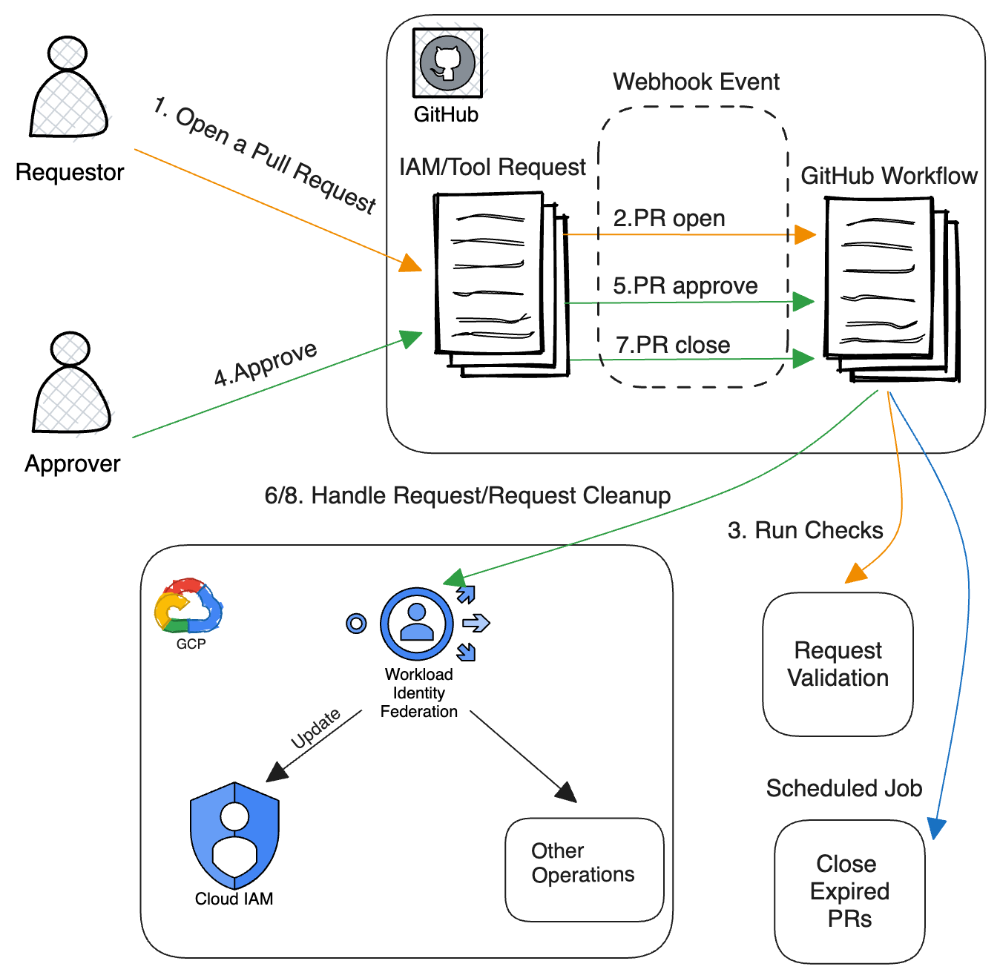

# Access on Demand

**This is not an official Google product.**

## Use Case

Access on Demand is a basic security and privacy control that prevents
unilateral access to GCP resources. It provides a solution to grant temporary
accesses on demand and to do certain cloud operations on behalf.

## High Level Flow

## Set Up

Please refer to the
[guide here](https://github.com/abcxyz/aod-template#prerequisites).

This is just some random change for testing purpose.
Committer change.
Committer change2.
